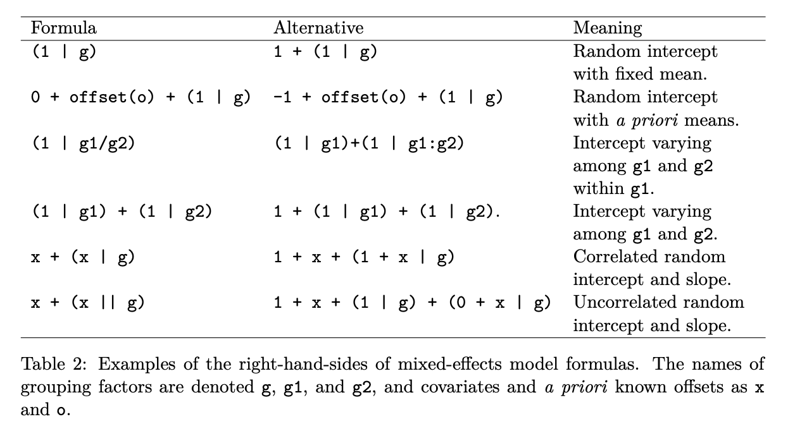

**Created January 28, 2025**

[Changes]{.underline}

-   1/28/25: loading data


```{r}
library(lme4)
library(dplyr)
library(ggplot2)
```

## Load Data

```{r}
# File from github
filepath = "https://raw.githubusercontent.com/shabanm2/Utqiagvik/main/Analysis_Ready_Data/"
df <- read.csv(paste0(filepath, "daily_2022_2024.csv"))
df <- df %>% select(-X) %>% select(-X.1)
df$Date <- as.POSIXct(df$date, format="%Y-%m-%d")
df <- df %>% filter(windspeed != -888.88) %>% filter(winddir != -888.88)
```

## Select and Transform Data

North vs South

TNHA:

North = TNHA-SC

South = TNHA-SA

SSMH:

North = SSMH-SB

South = SSMH-SA

BEO (Control): does not have different aspects

```{r}
nvs <- df %>% filter(fullname == "TNHA-SA" | fullname == "TNHA-SC" | fullname == "SSMH-SB" | fullname == "SSMH-SA") %>% select(-c(winddir, date)) %>% mutate(aspect = case_when(fullname == "TNHA-SC" | fullname == "SSMH-SB" ~ "North", .default = "South")) %>% na.omit() %>% filter(windspeed >= 0)
```


```{r}
# filter out data from before data collection
# filter to get only depth of 10cm for now
df_10cm_summer_2022 <- nvs %>% filter(grounddepth == 8) %>% filter(Date >= "2022-06-19") %>% filter(Date < "2022-09-01")
```


# Fit LMM

```{r}
summer2022_lmm <- lmer(groundtemp ~ airtemp + vwc + solar + windspeed + aspect + (1|site), data = df_10cm_summer_2022_summer_2022)
summary(summer2022_lmm)
```

It seems like there is not too much of a difference between the two sites, but there is still presence of a difference as shown by the two different intercepts for SSMH vs TNHA.

Graphing linear models:
Random effects have different intercepts, and the fixed effects have different slopes

```{r}
coeffs = coef(summer2022_lmm)$site
coeffs
```


```{r}
library(ggeffects)  # install the package first if you haven't already, then load it

# Extract the prediction data frame
pred.mm <- ggpredict(summer2022_lmm, terms = c("airtemp"))  # this gives overall predictions for the model

# Plot the predictions 

(ggplot(pred.mm) + 
    geom_point(data = df_10cm_summer_2022_summer_2022,                      # adding the raw data (scaled values)
              aes(x = airtemp, y = groundtemp, colour = site)) + 
   geom_line(aes(x = x, y = predicted, color = group)) +          # slope
   #geom_ribbon(aes(x = x, ymin = predicted - std.error, ymax = predicted + std.error), 
               #fill = "lightgrey", alpha = 0.5) +  # error band
   labs(x = "Air Temperature", y = "Ground Temperature", 
        title = "Relationship between air temperature and ground temperature") + 
   theme_minimal()
)
```

# Table Output
```{r}
library(stargazer)
stargazer(summer2022_lmm, type = "text",
          digits = 3,
          star.cutoffs = c(0.05, 0.01, 0.001),
          digit.separator = "")
```


```{r}
library(effects)
est<-Effect("airtemp", partial.residuals=T, summer2022_lmm)
plot(est)

plot(summer2022_lmm)

#library(remef)
#y_partial <- remef(model, fix = "x2", ran = "all")
```

```{r}
ggplot(df_10cm_summer_2022, aes(x=airtemp, y=solar)) + geom_point()
```


```{r}
var_df = df_10cm_summer_2022 %>% select(groundtemp, airtemp, vwc, solar, windspeed)
round(cor(var_df),
  digits = 2 # rounded to 2 decimals
)
```


# Analysis

We are particularly interested in five micrometeorological variables to conduct our LMM: ground temperature (`groundtemp`), air temperature (`airtemp`), volumetric water content or ground moisture (`vwc`), solar radiation (`solar`), and wind speed (`windspeed`). We are comparing how the five micrometerological variables may correlate at each of our three sites with varying levels of infrastructure. Our sites are SSMH (commercial/hospital), TNHA (residential), and BEO (tundra control). For our LMM, we will only be comparing SSMH and TNHA because we want to look at differences on the north and south sides of the buildings, and BEO does not have any infrastructure to block or otherwise impact the micrometeorology at the site.

Our model will compare our fixed effects against our response variable of interest, `groundtemp` The fixed effects will include `airtemp`, `vwc`, `solar`, and `windspeed.`

Additionally, want to look at differences in our five variables between the north-facing and south-facing sides of our buildings. This variable, `aspect`, will be the last of our fixed effects.

Our model only has one random effect, which is `site`. This accounts for any "random" differences observed between SSMH and TNHA due to having different geographic locations. At the time, we are not looking at differences between the sites as predictors of ground temperature.

The formula for our LMM is $groundtemp = airtemp + vwc + solar + windspeed + aspect + (1 |site)$

## Summer 2022

###  Correlation Matrix of Explanatory Variables

```{r}
var_df = df_10cm_summer_2022 %>% select(groundtemp, airtemp, vwc, solar, windspeed)
round(cor(var_df),
  digits = 2 # rounded to 2 decimals
)
```

### Random Effects

```{r}
lmm = summary(summer2022_lmm)
```

Variance of Random Effects
```{r}
lmm$varcor
```

The variance of the random effects show the variation of data (1) between sites and (2) within sites. Note that the standard deviation is the square root of the variance. The standard deviation is the spread of a group of data from the mean.

From our output, we see that there is more variation in values within sites than across from sites. However, there still is a difference in variation between sites.

**We may want to look into other ways of calculating our random effects to see if there are differences in slopes for our variables**



[Source: Fitting Linear Mixed-Effects Models Using lme4 Bates et al., 2015](https://cran.r-project.org/web/packages/lme4/vignettes/lmer.pdf)

I think we should try doing it with the correlated random intercept and slope, $x + (x|g)$ such that for each variable we have a fixed effect slope and a random effect slope. The full model would be $groundtemp = airtemp + vwc + solar + windspeed + aspect + (airtemp|site) + (vwc|site) + (solar|site) + (windspeed|site) + (aspect|site)$.

Site Intercepts
```{r}
coef(summer2022_lmm)$site
```
We can look at our intercepts for our two sites to assess whether or not there is a difference in our variables between our two sites. Based on our intercepts, it appears that there is some level of difference in ground temperature between the two sites.

This reinforces the use of correlated random intercept and slope as opposed to uncorrelated random intercept and slope in a subsequent model.


### Fixed Effects

```{r}
lmm$coefficients
```


Correlation of Fixed Effects

Note: this one is not super important. We can suppress this output by setting corr=FALSE in our lmer model.

From Clay Ford at the UVA StatLab:

"These are not correlations of the variables and this is not an assessment of collinearity. Instead it’s meant to give you some sense of the uncertainty in the estimated coefficients. For example, the solar coefficient is 0.008 with a standard error of 0.001. In repeated samples of this data, we expect the coefficient estimate to be between about 0.007 and 0.009. Likewise the estimated coefficient for airtmp is 0.504 with a standard error of 0.029. In repeated samples of this data, we expect the coefficient estimate to be between about 0.47 and 0.53. The correlation of those coefficients is about -0.464. This says in repeated samples we would expect one coefficient to go slightly down as the other goes slightly up. This is probably not that important in the grand scheme of things."
